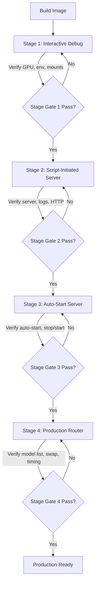

# Design Document: ROCm Router Improvements

## Overview

This design delivers a staged, iterative Docker-based multi-model inference server using llama.cpp with ROCm (AMD GPU) support. The approach restructures three existing files (Dockerfile, run-server.sh, entrypoint.sh) and adds one new file (TEST_PLAYBOOK.md) so that all four stages are present from the start — progression happens by commenting/uncommenting clearly marked sections, not by writing new code.

The four stages are:

1. **Interactive Debug Image** — shell access, manual server start, environment verification
2. **Script-Initiated Server** — run-script starts server, debug exec preserved
3. **Auto-Start Server** — ENTRYPOINT/CMD auto-launch, stop/start cycle
4. **Production Router Mode** — models-preset, dynamic model swap between multiple models

The llama.cpp build and model configuration are proven working. All work is environmental: permissions, groups, filesystem mounts, environment variables, GPU device access, and container orchestration.

### Key Design Decisions

1. **Single-file stage progression**: Each file contains all stages with comment blocks. No separate files per stage, no build arguments, no environment variable switches. The mechanism is human-readable commenting/uncommenting.

2. **Dockerfile uses ENTRYPOINT + CMD split**: ENTRYPOINT always points to entrypoint.sh. CMD varies by stage. Stage 1-2 override CMD via docker run arguments. Stage 3-4 use the built-in CMD.

3. **entrypoint.sh is stage-aware via arguments**: It doesn't need internal stage logic. The CMD/arguments passed to it determine behaviour — `--shell` for debug, explicit llama-server args for Stage 2, built-in CMD for Stage 3-4.

4. **run-server.sh contains all docker run variants**: Four commented blocks, one per stage. Each block is self-contained with all flags documented.

5. **Test playbook is a single document**: Covers pre-flight, all four stages, troubleshooting, and stage progression instructions. Each stage has numbered verification steps with exact commands and expected outputs.

6. **Security hardening is consistent across all stages**: read-only filesystem, tmpfs at /tmp, no-new-privileges, localhost binding, capability dropping, SELinux labels. Stage 1 relaxes only what's needed for interactive debugging.

## Architecture

### File Structure

```
research/rocm_llama.cpp_router/
├── Dockerfile              # Multi-stage build, commented CMD sections per stage
├── entrypoint.sh           # Privilege drop, XDG setup, shell/server/router dispatch
├── run-server.sh           # Container launch with 4 commented docker run blocks
├── models.ini              # Router mode model configuration (unchanged)
├── TEST_PLAYBOOK.md        # Complete manual verification for all stages
├── .dockerignore            # Build context exclusions (unchanged)
├── README.md               # Project overview (updated for stage documentation)
└── LICENSE                  # License file (unchanged)
```

### Stage Progression Flow



### Container Architecture

```mermaid
graph LR
    subgraph Host
        HF[~/.cache/huggingface] 
        MD[~/models]
        KFD[/dev/kfd]
        DRI[/dev/dri]
    end

    subgraph Container
        EP[entrypoint.sh]
        LS[llama-server]
        TMP[/tmp tmpfs 64MB]
        
        subgraph Mounts
            HFM[/huggingface rw]
            MDM[/models ro]
        end
        
        subgraph User
            LU[llama user]
            VG[video group]
            RG[render group]
        end
    end

    HF -->|bind mount, z label| HFM
    MD -->|bind mount, ro, z label| MDM
    KFD -->|--device| Container
    DRI -->|--device| Container
    EP -->|setpriv drop privs| LS
    LU -->|member of| VG
    LU -->|member of| RG
```

## Components and Interfaces

### Component 1: Dockerfile

The Dockerfile is the image build definition. It compiles llama-server with ROCm/HIP support and sets up the container environment.

**Current state**: Working build with a single ENTRYPOINT + CMD for router mode (Stage 4).

**Target state**: Same build process, but the final section has commented blocks for each stage's CMD configuration.

#### Dockerfile Structure

```dockerfile
# ============================================================
# BUILD SECTION (unchanged — proven working)
# ============================================================
FROM rocm/pytorch:rocm7.2.2_ubuntu24.04_py3.12_pytorch_release_2.10.0
# ... compile llama-server, install deps, copy binaries ...

# ============================================================
# USER AND GROUP SETUP (unchanged)
# ============================================================
# ... create llama user with video,render groups ...

# ============================================================
# COPY CONFIGURATION FILES
# ============================================================
COPY models.ini /etc/llama-server/models.ini
COPY entrypoint.sh /usr/local/bin/entrypoint.sh
RUN chmod +x /usr/local/bin/entrypoint.sh

# ============================================================
# ENTRYPOINT (constant across all stages)
# ============================================================
ENTRYPOINT ["/usr/local/bin/entrypoint.sh"]

# ============================================================
# STAGE 1 & 2: No CMD — arguments come from docker run
# ============================================================
# Stages 1 and 2 pass arguments via docker run command line.
# No CMD needed — entrypoint.sh handles whatever is passed.

# ============================================================
# STAGE 3: Auto-start single model (uncomment for Stage 3)
# ============================================================
# CMD ["--model", "hf=unsloth/Qwen3.6-27B-GGUF:Q8_0", \
#      "--host", "127.0.0.1", "--port", "8000", \
#      "--ctx-size", "262144", "--flash-attn", \
#      "--parallel", "3", "--temp", "0.6", "--top-p", "0.95", "--top-k", "20"]

# ============================================================
# STAGE 4: Router mode with models-preset (uncomment for Stage 4)
# ============================================================
# CMD ["--models-preset", "/etc/llama-server/models.ini", \
#      "--models-max", "1", \
#      "--host", "127.0.0.1", "--port", "8000"]
```

**Design rationale**: 
- ENTRYPOINT is constant — it always runs entrypoint.sh which handles privilege dropping and XDG setup.
- Stages 1-2 don't need a CMD because docker run passes the arguments directly.
- Stages 3-4 use CMD so the container auto-starts without arguments.
- Only one CMD block should be uncommented at a time. The Dockerfile's last CMD wins, so the active stage must be the last uncommented CMD.

### Component 2: entrypoint.sh

The entrypoint script handles privilege dropping, XDG directory setup, and dispatching to either a debug shell or llama-server.

**Current state**: Working — handles `--shell` for debug and defaults to llama-server with passed arguments.

**Target state**: Minimal changes. Add a `--keep-alive` mode for Stage 2 (container stays running if server fails) and ensure router mode arguments pass through cleanly.

#### entrypoint.sh Structure

```bash
#!/bin/sh
set -e

# ============================================================
# XDG BASE DIRECTORY SETUP
# All under /tmp for read-only filesystem compatibility
# ============================================================
mkdir -p /tmp/llama-cache /tmp/llama-config /tmp/llama-data
chmod 1777 /tmp/llama-cache /tmp/llama-config /tmp/llama-data

export XDG_CACHE_HOME=/tmp/llama-cache
export XDG_CONFIG_HOME=/tmp/llama-config
export XDG_DATA_HOME=/tmp/llama-data

# ============================================================
# STAGE 1: Interactive debug shell
# If first argument is --shell, sh, or bash, drop to shell as llama user
# Usage: docker run ... <image> --shell
# ============================================================
if [ "${1:-}" = "--shell" ] || [ "${1:-}" = "sh" ] || [ "${1:-}" = "bash" ]; then
    exec setpriv --reuid=$(id -u llama) --regid=$(id -g llama) --init-groups --inh-caps=-all \
        "$@"
fi

# ============================================================
# STAGE 2: Keep-alive mode (uncomment for Stage 2)
# Server runs in background; container stays alive for exec debugging
# If server crashes, container remains running for diagnosis
# Usage: docker run ... <image> --keep-alive <server-args...>
# ============================================================
# if [ "${1:-}" = "--keep-alive" ]; then
#     shift  # remove --keep-alive from args
#     setpriv --reuid=$(id -u llama) --regid=$(id -g llama) --init-groups --inh-caps=-all \
#         /usr/local/bin/llama/llama-server "$@" &
#     SERVER_PID=$!
#     echo "llama-server started as PID $SERVER_PID"
#     # Wait for server; if it exits, sleep forever so container stays up for debugging
#     wait $SERVER_PID || true
#     echo "llama-server exited (PID $SERVER_PID). Container staying alive for debugging."
#     echo "Exec in with: docker exec -it <container> /usr/local/bin/entrypoint.sh --shell"
#     tail -f /dev/null
# fi

# ============================================================
# STAGE 3 & 4: Default — drop to llama user and run llama-server
# Arguments come from CMD (Stage 3/4) or docker run (Stage 2 without keep-alive)
# --init-groups rebuilds supplementary groups from /etc/group (video, render)
# --inh-caps=-all drops all inheritable capabilities
# ============================================================
exec setpriv --reuid=$(id -u llama) --regid=$(id -g llama) --init-groups --inh-caps=-all \
    /usr/local/bin/llama/llama-server "$@"
```

**Design rationale**:
- Stage 1 (`--shell`): Already working. No changes needed.
- Stage 2 (`--keep-alive`): Runs server in background, waits for it, then keeps container alive if it crashes. This satisfies Requirement 3.7 (container remains running for diagnosis).
- Stage 3-4 (default `exec`): Already working. CMD arguments pass through cleanly. Router mode args (`--models-preset`, `--models-max`) are just more arguments to llama-server.

### Component 3: run-server.sh

The run script launches the container with all security hardening flags and bind mounts.

**Current state**: Single docker run command for router mode.

**Target state**: Four commented docker run blocks, one per stage. Each block is self-contained and fully documented.

#### run-server.sh Structure

```bash
#!/usr/bin/env bash
# run-server.sh — Launch llama.cpp server container
#
# STAGE PROGRESSION:
#   1. Uncomment the desired stage's docker run block
#   2. Comment out all other stage blocks
#   3. Run this script
#
# Security hardening (all stages):
#   --read-only           : immutable container filesystem
#   --tmpfs /tmp          : writable temp with noexec,nosuid,64MB limit
#   --no-new-privileges   : prevent privilege escalation via setuid/setgid
#   --network host        : use host network (server binds to 127.0.0.1)
#   --device /dev/kfd     : AMD GPU kernel fusion driver
#   --device /dev/dri     : AMD GPU direct rendering interface
#   --group-add video     : GPU access group
#   --group-add render    : GPU render group
#   ,z SELinux label      : shared mount label for SELinux hosts
#
set -euo pipefail

IMAGE_NAME="llama-cpp-server"
CONTAINER_NAME="llama-server"
HF_CACHE="${HF_CACHE_DIR:-$HOME/.cache/huggingface}"
MODELS_DIR="${MODELS_DIR:-$HOME/models}"

mkdir -p "$HF_CACHE" "$MODELS_DIR"

# Clean up existing container if present
if docker ps -a --format '{{.Names}}' | grep -q "^${CONTAINER_NAME}$"; then
  docker rm -f "$CONTAINER_NAME" >/dev/null 2>&1
fi

# ============================================================
# STAGE 1: Interactive Debug Image
# Starts an interactive shell as llama user.
# Manually start llama-server from inside the container.
# ============================================================
docker run -it \
  --name "$CONTAINER_NAME" \
  --read-only \
  --tmpfs /tmp:rw,noexec,nosuid,size=64m \
  --security-opt no-new-privileges:true \
  --device /dev/kfd \
  --device /dev/dri \
  --group-add video \
  --group-add render \
  --network host \
  --mount type=bind,source="$HF_CACHE",target=/huggingface,z \
  --mount type=bind,source="$MODELS_DIR",target=/models,readonly,z \
  "$IMAGE_NAME" \
  --shell

# ============================================================
# STAGE 2: Script-Initiated Server with Debug Access
# Server starts via --keep-alive; container stays up if server crashes.
# Debug with: docker exec -it llama-server /usr/local/bin/entrypoint.sh --shell
# ============================================================
# docker run -d \
#   --name "$CONTAINER_NAME" \
#   --read-only \
#   --tmpfs /tmp:rw,noexec,nosuid,size=64m \
#   --security-opt no-new-privileges:true \
#   --device /dev/kfd \
#   --device /dev/dri \
#   --group-add video \
#   --group-add render \
#   --network host \
#   --mount type=bind,source="$HF_CACHE",target=/huggingface,z \
#   --mount type=bind,source="$MODELS_DIR",target=/models,readonly,z \
#   "$IMAGE_NAME" \
#   --keep-alive \
#   --model hf=unsloth/Qwen3.6-27B-GGUF:Q8_0 \
#   --host 127.0.0.1 --port 8000 \
#   --ctx-size 262144 --flash-attn \
#   --parallel 3 --temp 0.6 --top-p 0.95 --top-k 20

# ============================================================
# STAGE 3: Auto-Start Server Image
# Server starts automatically via Dockerfile CMD.
# No extra arguments needed — CMD provides them.
# Debug with: docker exec -it llama-server /usr/local/bin/entrypoint.sh --shell
# ============================================================
# docker run -d \
#   --name "$CONTAINER_NAME" \
#   --read-only \
#   --tmpfs /tmp:rw,noexec,nosuid,size=64m \
#   --security-opt no-new-privileges:true \
#   --device /dev/kfd \
#   --device /dev/dri \
#   --group-add video \
#   --group-add render \
#   --network host \
#   --mount type=bind,source="$HF_CACHE",target=/huggingface,z \
#   --mount type=bind,source="$MODELS_DIR",target=/models,readonly,z \
#   "$IMAGE_NAME"

# ============================================================
# STAGE 4: Production Router Mode
# Server starts in router mode via Dockerfile CMD.
# Uses --models-preset for multi-model swap.
# No extra arguments needed — CMD provides them.
# Debug with: docker exec -it llama-server /usr/local/bin/entrypoint.sh --shell
# ============================================================
# docker run -d \
#   --name "$CONTAINER_NAME" \
#   --read-only \
#   --tmpfs /tmp:rw,noexec,nosuid,size=64m \
#   --security-opt no-new-privileges:true \
#   --device /dev/kfd \
#   --device /dev/dri \
#   --group-add video \
#   --group-add render \
#   --network host \
#   --mount type=bind,source="$HF_CACHE",target=/huggingface,z \
#   --mount type=bind,source="$MODELS_DIR",target=/models,readonly,z \
#   "$IMAGE_NAME"
```

**Design rationale**:
- Stage 1 uses `docker run -it` (interactive + tty) with `--shell` argument. This is the only stage that runs interactively.
- Stages 2-4 use `docker run -d` (detached). Logs via `docker logs`.
- Stage 2 passes `--keep-alive` plus explicit server arguments. The entrypoint runs the server in background and keeps the container alive on failure.
- Stages 3 and 4 pass no extra arguments — the Dockerfile CMD provides them. The docker run blocks are identical; the difference is which CMD is uncommented in the Dockerfile.
- Every flag is documented in the header comment.

### Component 4: TEST_PLAYBOOK.md

A single document covering pre-flight checks, all four stages, troubleshooting, and stage progression instructions.

#### Test Playbook Structure

```
TEST_PLAYBOOK.md
├── Pre-Flight Checklist
│   ├── Host prerequisites (ROCm driver, Docker, GPU devices)
│   ├── Model pre-download verification
│   └── Image build verification
├── Stage 1: Interactive Debug Image
│   ├── Launch container
│   ├── Verify GPU device access
│   ├── Verify environment variables
│   ├── Verify group membership
│   ├── Verify file permissions on mounts
│   ├── Verify library paths
│   ├── Manual llama-server invocation
│   ├── Manual HTTP test
│   └── Stage Gate 1 checklist
├── Stage 2: Script-Initiated Server
│   ├── Progression instructions (comment/uncomment)
│   ├── Launch container
│   ├── Verify server process
│   ├── Verify logs
│   ├── Verify HTTP endpoints
│   ├── Exec-based debugging
│   ├── Verify GPU memory usage
│   └── Stage Gate 2 checklist
├── Stage 3: Auto-Start Server
│   ├── Progression instructions (comment/uncomment)
│   ├── Rebuild image (uncomment CMD)
│   ├── Launch container
│   ├── Verify automatic startup
│   ├── Stop/start cycle test
│   ├── Verify HTTP after restart
│   ├── Exec-based debugging
│   └── Stage Gate 3 checklist
├── Stage 4: Production Router Mode
│   ├── Progression instructions (comment/uncomment)
│   ├── Rebuild image (uncomment router CMD)
│   ├── Launch container
│   ├── Verify model listing
│   ├── Chat completion with startup model
│   ├── Model swap test
│   ├── Swap timing measurement
│   ├── Error handling for unknown model
│   ├── Concurrent request during swap
│   └── Stage Gate 4 checklist
└── Troubleshooting
    ├── GPU device permission errors
    ├── Library path issues
    ├── Mount permission errors
    ├── Port binding failures
    ├── Server crash diagnosis
    └── Model loading failures
```

Each verification step follows this format:

```markdown
### Step N.M: Description

**Command:**
```bash
<exact command to run>
```

**Expected output:**
```
<what success looks like — exact text or pattern>
```

**If it fails:**
<diagnostic command and what to look for>
```

### Component 5: models.ini (Unchanged)

The models.ini file is already correctly configured for router mode. No changes needed. It defines:
- Global defaults in `[*]` section: flash-attn, parallel, tensor-split, cache types
- Per-model sections with HuggingFace paths, context sizes, and sampling parameters
- `load-on-startup = true` on the Qwen3.6-27B model

### Component Interaction by Stage

| Stage | run-server.sh | entrypoint.sh | Dockerfile CMD | Result |
|-------|--------------|---------------|----------------|--------|
| 1 | `docker run -it ... --shell` | Detects `--shell`, execs shell as llama | None needed | Interactive shell |
| 2 | `docker run -d ... --keep-alive --model ...` | Detects `--keep-alive`, runs server in bg, stays alive on crash | None needed | Detached server + debug access |
| 3 | `docker run -d ...` (no extra args) | Default path: execs llama-server with CMD args | `--model hf=... --host ... --port ...` | Auto-start single model |
| 4 | `docker run -d ...` (no extra args) | Default path: execs llama-server with CMD args | `--models-preset ... --models-max 1 --host ... --port ...` | Auto-start router mode |

## Data Models

Not applicable — this feature involves Docker configuration, shell scripts, and documentation. There are no data models, database schemas, or persistent data structures.

The only structured data is models.ini, which is an INI configuration file already defined and working. Its schema is dictated by llama.cpp's `--models-preset` parser:

```ini
version = 1

[*]                          # Global defaults applied to all models
flash-attn = 1               # Enable flash attention
parallel = 3                 # Parallel request slots
tensor-split = 12/19         # GPU memory split ratio
cache-type-k = bf16          # Key cache type
cache-type-v = bf16          # Value cache type

[model-name:quantization]    # Per-model section (HuggingFace repo:quant format)
hf = <repo>:<quant>          # HuggingFace model path
load-on-startup = true       # Optional: load when server starts
ctx-size = <int>             # Context window size
temp = <float>               # Sampling temperature
top-p = <float>              # Top-p sampling
top-k = <int>                # Top-k sampling
```

## Error Handling

### Container Build Errors

| Error | Cause | Resolution |
|-------|-------|------------|
| CMake HIP detection fails | ROCm base image version mismatch or missing HIP tools | Verify base image tag matches ROCm version. Check `hipconfig -l` and `hipconfig -R` exist in base image |
| llama-server compile fails | Pinned commit incompatible with ROCm version | Check llama.cpp release notes for ROCm compatibility. Update commit hash if needed |
| Group creation fails | video/render groups already exist in base image | The `2>/dev/null` on groupadd handles this — not a real error |

### Container Runtime Errors

| Error | Cause | Resolution |
|-------|-------|------------|
| `/dev/kfd: Permission denied` | Missing `--device /dev/kfd` or user not in video group | Check `docker run` flags. Verify `--group-add video` and `--group-add render` |
| `libhiprtc.so: cannot open shared object` | LD_LIBRARY_PATH not set or missing libraries | Verify `LD_LIBRARY_PATH` includes `/usr/local/bin/llama`. Check library files exist |
| `bind: Address already in use` | Port 8000 already occupied on host | Stop existing process on port 8000: `lsof -i :8000` |
| `read-only file system` | Attempting to write outside /tmp | Verify tmpfs mount at /tmp. Check XDG vars point to /tmp subdirectories |
| Model file not found | HF_Cache not mounted or model not pre-downloaded | Verify mount: `ls /huggingface/hub/`. Pre-download models on host |
| Server exits immediately | Missing GPU, wrong architecture, or model too large for VRAM | Check `docker logs`. Verify GPU architecture matches `LLAMACPP_ROCM_ARCH` |

### Stage 2 Specific: Keep-Alive Behaviour

When `--keep-alive` is active and llama-server crashes:
1. The entrypoint catches the exit via `wait $SERVER_PID || true`
2. Prints diagnostic message to stdout (visible in `docker logs`)
3. Runs `tail -f /dev/null` to keep container alive indefinitely
4. Developer can exec in to diagnose: `docker exec -it llama-server /usr/local/bin/entrypoint.sh --shell`

### Stage 4 Specific: Router Mode Errors

| Error | Cause | Resolution |
|-------|-------|------------|
| Model not found in preset | Request specifies model name not in models.ini | llama-server returns HTTP 404 or error JSON. Check model names match INI section headers exactly |
| Swap timeout | Model too large or GPU memory fragmentation | Check `docker logs` for unload/load timing. Restart container to clear VRAM |
| Out of VRAM during swap | Previous model not fully unloaded before new model loads | `--models-max 1` ensures sequential unload/load. If persists, reduce ctx-size |

## Testing Strategy

### Why Property-Based Testing Does Not Apply

This feature consists entirely of:
- **Dockerfile** — declarative infrastructure configuration
- **Shell scripts** — side-effect-only operations (launching containers, mounting devices, dropping privileges)
- **INI configuration** — static configuration consumed by llama-server
- **Documentation** — prose test playbook

There are no pure functions, data transformations, parsers, serializers, or business logic to property-test. The "inputs" are host environment state (GPU devices, file permissions, group membership) and the "outputs" are container runtime behaviour (process status, HTTP responses, log content). These are integration-level concerns best verified by manual execution against real hardware.

### Testing Approach: Manual Test Playbook

The primary testing mechanism is TEST_PLAYBOOK.md — a structured document of exact console commands with expected outputs. This is appropriate because:

1. **Hardware dependency**: Every test requires a physical AMD GPU with ROCm drivers. No meaningful mocking is possible.
2. **Environment verification**: Tests check real device nodes, real group membership, real filesystem permissions.
3. **Sequential stage gates**: Each stage must pass before the next begins. This is inherently a manual, sequential process.
4. **Observable outputs**: Success/failure is determined by command output, HTTP responses, and log content — all directly observable.

### Test Categories

| Category | What it verifies | How |
|----------|-----------------|-----|
| **Pre-flight** | Host prerequisites exist | Shell commands checking device nodes, Docker version, model files |
| **Environment** | Container internals are correct | `id`, `env`, `ls -la` inside container |
| **Functional** | Server starts and responds | `curl` to HTTP endpoints, response validation |
| **Security** | Hardening flags are effective | Verify read-only FS, check capabilities, confirm non-root |
| **Stage gate** | All criteria for a stage pass | Checklist of pass/fail items |
| **Troubleshooting** | Diagnose common failures | Diagnostic commands with interpretation guidance |

### Test Execution

Tests are executed manually by a human operator following TEST_PLAYBOOK.md. The playbook is designed to be:
- **Self-contained**: No external knowledge required beyond the playbook itself
- **Sequential**: Steps within a stage are ordered and depend on prior steps
- **Diagnostic**: Every step includes failure guidance
- **Reproducible**: Exact commands, no ambiguity

### Unit Tests and Integration Tests

No automated unit tests or integration tests are included in this design. The rationale:

- **No testable code units**: Shell scripts are thin wrappers around Docker and setpriv. Testing them in isolation would require mocking Docker, the filesystem, and GPU devices — producing tests that verify mocks, not reality.
- **Integration is the test**: The entire purpose of each stage is to verify that the real environment works. The test playbook IS the integration test suite, executed by a human against real hardware.
- **CI/CD consideration**: If automated CI is desired in the future, the pre-flight and environment checks could be scripted as a smoke test suite. This is out of scope for the current design.
